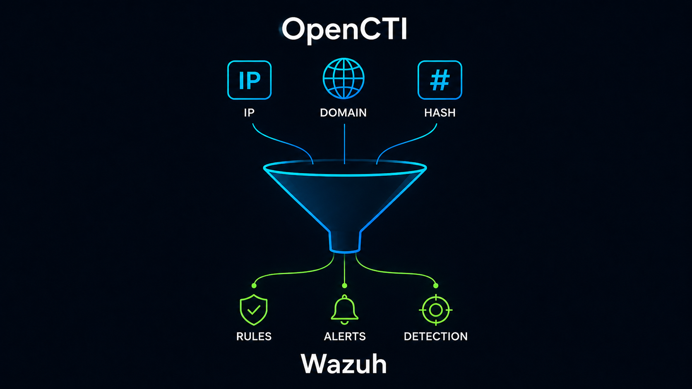

# Wazuh-TI

<div align="center">



**Threat Intelligence ingestion pipeline for Wazuh detections**

[](https://github.com/federicofantini/Wazuh-TI/releases/)
[](#license)
[](https://github.com/federicofantini/Wazuh-TI/issues)
[](https://github.com/federicofantini/Wazuh-TI/stargazers)
[](https://github.com/federicofantini/Wazuh-TI/forks)
[](https://github.com/federicofantini/Wazuh-TI/commits/main)
[](https://www.python.org/)
[](https://www.gnu.org/software/bash/)
[](https://wazuh.com/)
[](https://www.opencti.io/)

</div>

---

## 0. Reference

This repository serves as supplementary material for this blog post: https://blog.federicofantini.net/blog/2026/03/23/Wauh-Threat-Intelligence.html

## 1. Overview

This guide explains how to deploy the full Threat Intelligence pipeline:

- TI feed automation (Wazuh Manager)
- CDB list integration
- Custom detection rules
- Suricata network telemetry (Linux agent)
- Sysmon telemetry (Windows agent)
- Scheduled updates via cron

This guide is operational and step-by-step. This document focuses exclusively on deployment steps.

To better understand the implementation choices and how the project works, refer to this blog post: ...

## 2. Wazuh Manager Setup

All manager-side files are located under:

```
wazuh-manager/
```

### 2.1 Install the TI Update Script

Copy:

```
wazuh-manager/usr/local/bin/update-ti-lists.sh
```

To:

```
/usr/local/bin/update-ti-lists.sh
```

Set execution permissions:

```bash
chmod +x /usr/local/bin/update-ti-lists.sh
```

Configure the env vars here: `/etc/default/wazuh-ti`

```
THREATFOX_AUTH_KEY="..."
THREATFOX_DAYS=1
OTX_ALIENVAULT_AUTH_KEY="..."
OTX_DAYS_DELTA=1
```

---

### 2.2 Install Custom TI Rules

Copy:

```
wazuh-manager/var/ossec/etc/rules/local_ti_rules_linux.xml
wazuh-manager/var/ossec/etc/rules/local_ti_rules_windows.xml
```

To:

```
/var/ossec/etc/rules/
```

Verify permissions:

```bash
chown wazuh:wazuh /var/ossec/etc/rules/local_ti_rules_*.xml
```

---

### 2.3 Update Wazuh Manager ossec.conf

Merge the relevant configuration from:

```
wazuh-manager/var/ossec/etc/ossec.conf
```

Into:

```
/var/ossec/etc/ossec.conf
```

Ensure the `<ruleset>` section contains:

```xml
<ruleset>
  ...
  <!-- TI ruleset -->
  <list>etc/lists/threatview_cs_c2</list>
  <list>etc/lists/threatfox_ip</list>
  <list>etc/lists/threatfox_domain</list>
  <list>etc/lists/et_compromised_ips</list>
  <list>etc/lists/et_ciarmy</list>
  <list>etc/lists/et_drop</list>
  <list>etc/lists/et_tor</list>
  <list>etc/lists/et_dshield</list>
  ...
</ruleset>
```

Adjust list names according to the output generated by `update-ti-lists.sh`.

---

### 2.4 Configure Cron on Manager

Open crontab:

```bash
crontab -e
```

Insert:

```
0  3 * * * /usr/local/bin/update-ti-lists.sh >> /var/log/wazuh-ti-update.log 2>&1
15 3 * * * test -s /var/log/wazuh-ti-update.log && systemctl restart wazuh-manager >> /var/log/wazuh-restart.log 2>&1
```

This configuration:

- Updates TI feeds daily at 03:00
- Restarts Wazuh Manager at 03:15 only if the update produced output
- Ensures CDB lists are recompiled and loaded correctly

---

### 2.5 Ensure lists folder exist

```bash
mkdir -p /var/ossec/etc/lists
chown wazuh:wazuh /var/ossec/etc/lists
```

---

### 2.6 Initial Restart

After completing setup:

```bash
systemctl restart wazuh-manager
```

This ensures:

- Custom rules are loaded
- CDB lists are compiled
- Detection becomes active

### 2.7 OpenCTI Integration

This alternative integration exports OpenCTI TAXII indicators into Wazuh CDB lists.

Generated lists:

```text
opencti_ips
opencti_domains
opencti_file_hashes
```

Final Wazuh destination:

```text
/var/ossec/etc/lists/
```

#### Install the OpenCTI fetch user

Create a dedicated unprivileged user:

```bash
sudo adduser --disabled-password --gecos "" opencti-ti

sudo -u opencti-ti mkdir -p /home/opencti-ti/bin
sudo -u opencti-ti mkdir -p /home/opencti-ti/iocs
sudo -u opencti-ti mkdir -p /home/opencti-ti/logs
```

Copy the fetch script:

```bash
sudo cp wazuh-manager/usr/local/bin/fetch_opencti_iocs.py /home/opencti-ti/bin/fetch_opencti_iocs.py
sudo chown opencti-ti:opencti-ti /home/opencti-ti/bin/fetch_opencti_iocs.py
sudo chmod 750 /home/opencti-ti/bin/fetch_opencti_iocs.py
```

At a minimum, configure the essential global variables in the script:

```python
TAXII_URL = "..."
OUTPUT_DIR = "/home/opencti-ti/iocs"
TRANCO_DIR = "/home/opencti-ti/bin"
```

The script extracts IPs, domains/hostnames/URL-hosts, and file hashes, applies Tranco-based filtering to the domain list, and writes the resulting indicators into the three Wazuh CDB list files.

Test it manually:

```bash
sudo -u opencti-ti /usr/bin/python3 /home/opencti-ti/bin/fetch_opencti_iocs.py
sudo -u opencti-ti ls -lh /home/opencti-ti/iocs/
```

#### Schedule OpenCTI updates

Edit the `opencti-ti` crontab:

```bash
sudo crontab -u opencti-ti -e
```

Run the fetch every day:

```cron
0 3 * * * /usr/bin/python3 /home/opencti-ti/bin/fetch_opencti_iocs.py >> /home/opencti-ti/logs/fetch_opencti_iocs.log 2>&1
```

Configure log rotation:

```bash
sudo tee /etc/logrotate.d/opencti-ti >/dev/null <<'EOF'
/home/opencti-ti/logs/fetch_opencti_iocs.log {
    size 10M
    rotate 4
    compress
    delaycompress
    missingok
    notifempty
    copytruncate
    su opencti-ti opencti-ti
}
EOF

sudo -u opencti-ti touch /home/opencti-ti/logs/fetch_opencti_iocs.log
```

#### Copy lists into Wazuh

Add a root cron job on the Wazuh Manager:

```bash
sudo crontab -e
```

Copy the generated files into Wazuh and restart the manager:

```cron
30 3,21 * * * cp /home/opencti-ti/iocs/opencti_ips /home/opencti-ti/iocs/opencti_domains /home/opencti-ti/iocs/opencti_file_hashes /var/ossec/etc/lists/ && chown wazuh:wazuh /var/ossec/etc/lists/opencti_ips /var/ossec/etc/lists/opencti_domains /var/ossec/etc/lists/opencti_file_hashes && chmod 640 /var/ossec/etc/lists/opencti_ips /var/ossec/etc/lists/opencti_domains /var/ossec/etc/lists/opencti_file_hashes && systemctl restart wazuh-manager
```

#### Register the CDB lists

Add the lists to the `<ruleset>` section in `/var/ossec/etc/ossec.conf`:

```xml
<list>etc/lists/opencti_ips</list>
<list>etc/lists/opencti_domains</list>
<list>etc/lists/opencti_file_hashes</list>
```

#### Install OpenCTI rules

Copy:

```
wazuh-manager/var/ossec/etc/rules/local_ti_rules_opencti_linux.xml
wazuh-manager/var/ossec/etc/rules/local_ti_rules_opencti_windows.xml
```

To:

```
/var/ossec/etc/rules/
```

Verify permissions:

```bash
chown wazuh:wazuh /var/ossec/etc/rules/local_ti_rules_*.xml
```

Restart the manager:
```bash
sudo systemctl restart wazuh-manager
```

#### Verify

```bash
sudo -u opencti-ti ls -lh /home/opencti-ti/iocs/
sudo ls -lh /var/ossec/etc/lists/opencti_*
sudo ls -lh /var/ossec/etc/lists/opencti_*.cdb
sudo systemctl status wazuh-manager
sudo /var/ossec/bin/wazuh-logtest
```

---

## 3. Linux Agent Setup (Suricata + Wazuh Agent)

All agent-side files are located under:

```
wazuh-agent/
```

---

### 3.1 Install Suricata

#### Debian / Ubuntu

```bash
sudo apt update
sudo apt install suricata
```

#### RHEL / CentOS

```bash
sudo yum install epel-release
sudo yum install suricata
```

Verify installation:

```bash
suricata --build-info
```

Enable and start Suricata:

```bash
systemctl enable suricata
systemctl start suricata
```

---

### 3.2 Install Custom Suricata Configuration

Copy:

```
wazuh-agent/etc/suricata/suricata.yaml
```

To:

```
/etc/suricata/suricata.yaml
```

Check the config with: `suricata -T -c /etc/suricata/suricata.yaml -v`

Ensure EVE JSON output is enabled and writing to:

```
/var/log/suricata/eve.json
```

Restart Suricata:

```bash
systemctl restart suricata
```

---

### 3.3 Install Suricata Update Script

Copy:

```
wazuh-agent/usr/local/sbin/suricata-update.sh
```

To:

```
/usr/local/sbin/suricata-update.sh
```

Set permissions:

```bash
chmod +x /usr/local/sbin/suricata-update.sh
```

---

### 3.4 Configure Suricata Rule Update Cron (Agent)

Open crontab:

```bash
crontab -e
```

Insert:

```
15 3,9,15,18 * * * /usr/local/sbin/suricata-update.sh
```

This updates Suricata rules multiple times per day.

---

### 3.5 Configure Wazuh Agent ossec.conf

Copy:

```
wazuh-agent/var/ossec/etc/ossec.conf
```

Merge into:

```
/var/ossec/etc/ossec.conf
```

Ensure Suricata log collection is configured:

```xml
<localfile>
  <log_format>json</log_format>
  <location>/var/log/suricata/eve.json</location>
</localfile>
```

Restart agent:

```bash
systemctl restart wazuh-agent
```

---

## 4. Windows Agent (Sysmon)

Follow the official Wazuh guide for Sysmon installation > Detection with Wazuh:

https://wazuh.com/blog/detecting-process-injection-attacks-with-wazuh/

In this repository:

```
wazuh-agent/sysmon/sysmonconfig.xml
```

Install Sysmon:

```powershell
Sysmon64.exe -accepteula -i sysmonconfig.xml
```

Ensure the Wazuh agent collects Windows Event Logs as documented in the official guide.

---

## 5. Verification

After deployment:

1. Confirm TI lists exist:

   `ls /var/ossec/etc/lists/ | grep -vP '\.cdb$'`
   ```bash
   et_ciarmy
   et_compromised_ips
   et_drop
   et_dshield
   et_tor
   ipsum_bad_ips
   openphish_domain
   otx_alienvault_domain
   otx_alienvault_ip
   threatfox_domain
   threatfox_ip
   threatview_cs_c2
   ```

2. Confirm CDB files are compiled:

   `ls /var/ossec/etc/lists/*.cdb`
   ```bash
   et_ciarmy.cdb
   et_compromised_ips.cdb
   et_drop.cdb
   et_dshield.cdb
   et_tor.cdb
   ipsum_bad_ips.cdb
   openphish_domain.cdb
   otx_alienvault_domain.cdb
   otx_alienvault_ip.cdb
   threatfox_domain.cdb
   threatfox_ip.cdb
   threatview_cs_c2.cdb
   ```

3. Check manager status:

   ```bash
   systemctl status wazuh-manager
   ```

4. Test rule evaluation:

   ```bash
   /var/ossec/bin/wazuh-logtest
   ```

5. Check the logfile: `/var/log/wazuh-ti-update.log`

   ```
   2026-03-07 03:00:03 Wrote /var/ossec/etc/lists/threatview_cs_c2 (1704 entries)
   2026-03-07 03:00:08 Wrote /var/ossec/etc/lists/et_compromised_ips (1740 entries)
   2026-03-07 03:00:14 Wrote /var/ossec/etc/lists/et_ciarmy (73986 entries)
   2026-03-07 03:00:17 Wrote /var/ossec/etc/lists/et_drop (2779 entries)
   2026-03-07 03:00:19 Wrote /var/ossec/etc/lists/et_tor (18210 entries)
   2026-03-07 03:00:19 Wrote /var/ossec/etc/lists/et_dshield (74 entries)
   2026-03-07 03:00:20 Wrote /var/ossec/etc/lists/threatfox_ip (4734 entries)
   2026-03-07 03:00:20 Wrote /var/ossec/etc/lists/threatfox_domain (9685 entries)
   2026-03-07 03:00:20 Fetching OTX pulses (local filter: indicators created in last 1 days)
   2026-03-07 03:00:24 Fetched OTX pulse (size=0MB)
   2026-03-07 03:00:24 Wrote /var/ossec/etc/lists/otx_alienvault_ip (157 entries)
   2026-03-07 03:00:24 Wrote /var/ossec/etc/lists/otx_alienvault_domain (13480 entries)
   2026-03-07 03:00:24 Wrote /var/ossec/etc/lists/openphish_domain (5662 entries)
   2026-03-07 03:00:24 Wrote /var/ossec/etc/lists/ipsum_bad_ips (714593 entries)
   2026-03-07 03:00:24 Deduplicating /var/ossec/etc/lists/threatfox_ip
   2026-03-07 03:00:24 Dedup completed for /var/ossec/etc/lists/threatfox_ip (4706 entries, removed 28)
   2026-03-07 03:00:24 Deduplicating /var/ossec/etc/lists/threatfox_domain
   2026-03-07 03:00:24 Dedup completed for /var/ossec/etc/lists/threatfox_domain (9676 entries, removed 9)
   2026-03-07 03:00:24 Deduplicating /var/ossec/etc/lists/threatview_cs_c2
   2026-03-07 03:00:24 Dedup completed for /var/ossec/etc/lists/threatview_cs_c2 (852 entries, removed 852)
   2026-03-07 03:00:24 Deduplicating /var/ossec/etc/lists/et_compromised_ips
   2026-03-07 03:00:24 Dedup completed for /var/ossec/etc/lists/et_compromised_ips (1200 entries, removed 540)
   2026-03-07 03:00:24 Deduplicating /var/ossec/etc/lists/et_ciarmy
   2026-03-07 03:00:24 Dedup completed for /var/ossec/etc/lists/et_ciarmy (60494 entries, removed 13492)
   2026-03-07 03:00:24 Deduplicating /var/ossec/etc/lists/et_drop
   2026-03-07 03:00:24 Dedup completed for /var/ossec/etc/lists/et_drop (1556 entries, removed 1223)
   2026-03-07 03:00:24 Deduplicating /var/ossec/etc/lists/et_tor
   2026-03-07 03:00:24 Dedup completed for /var/ossec/etc/lists/et_tor (10984 entries, removed 7226)
   2026-03-07 03:00:24 Deduplicating /var/ossec/etc/lists/et_dshield
   2026-03-07 03:00:24 Dedup completed for /var/ossec/etc/lists/et_dshield (55 entries, removed 19)
   2026-03-07 03:00:24 Deduplicating /var/ossec/etc/lists/otx_alienvault_ip
   2026-03-07 03:00:24 Dedup completed for /var/ossec/etc/lists/otx_alienvault_ip (157 entries, removed 0)
   2026-03-07 03:00:24 Deduplicating /var/ossec/etc/lists/otx_alienvault_domain
   2026-03-07 03:00:25 Dedup completed for /var/ossec/etc/lists/otx_alienvault_domain (13480 entries, removed 0)
   2026-03-07 03:00:25 Deduplicating /var/ossec/etc/lists/openphish_domain
   2026-03-07 03:00:25 Dedup completed for /var/ossec/etc/lists/openphish_domain (5586 entries, removed 76)
   2026-03-07 03:00:25 Deduplicating /var/ossec/etc/lists/ipsum_bad_ips
   2026-03-07 03:00:26 Dedup completed for /var/ossec/etc/lists/ipsum_bad_ips (509765 entries, removed 204828)
   2026-03-07 03:00:26 Done
   ```

6. Generate a test event matching a known indicator.

If configured correctly, alerts should appear in:

- Wazuh Dashboard
- Discord (if webhook integration is configured)

---

## 6. Final Notes

This setup:

- Does not modify Wazuh core
- Uses documented CDB list and rule mechanisms
- Can be removed cleanly
- Can coexist with future native CTI functionality

When Wazuh introduces fully integrated CTI feed management, this pipeline can be replaced or adapted accordingly.
