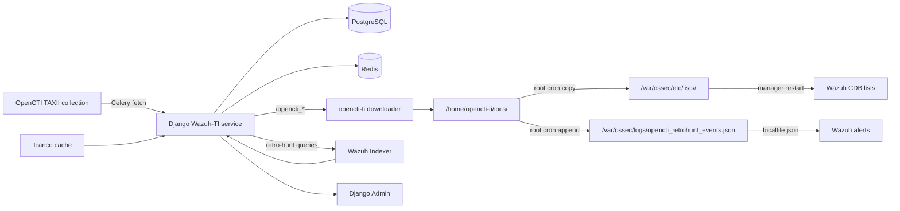

# Wazuh-TI

<div align="center">


**OpenCTI ingestion and retro-hunting pipeline for Wazuh**

[](LICENSE)
[](https://www.python.org/)
[](https://wazuh.com/)
[](https://www.opencti.io/)

</div>

Wazuh-TI is a small Django/Celery service that pulls indicators from an OpenCTI TAXII collection, maintains a current-state snapshot, exports Wazuh-ready CDB lists over HTTP, and runs retro-hunting queries against the Wazuh Indexer when new IOCs arrive. The Wazuh manager never connects to OpenCTI directly — it uses a dedicated unprivileged account to download the exported artifacts on a schedule.

Related blog post: https://blog.federicofantini.net/blog/2026/06/24/Extending-Wazuh-Threat-Intelligence-with-OpenCTI.html

Previous post (original script-based pipeline): https://blog.federicofantini.net/blog/2026/03/23/Wazuh-Threat-Intelligence.html

## Architecture



## Exported endpoints

The service exposes four authenticated HTTP endpoints:

| Endpoint | Format | Consumed by |
|---|---|---|
| `/opencti_ips` | Wazuh CDB source list | root cron → `/var/ossec/etc/lists/opencti_ips` |
| `/opencti_domains` | Wazuh CDB source list | root cron → `/var/ossec/etc/lists/opencti_domains` |
| `/opencti_file_hashes` | Wazuh CDB source list | root cron → `/var/ossec/etc/lists/opencti_file_hashes` |
| `/opencti_retrohunt_events.json` | Newline-delimited JSON | root cron appends → Wazuh localfile |

All requests require `Authorization: Bearer <export_api_token>`. If the token field is left empty in Django Admin, all requests are accepted without authentication.

IPv6 addresses in `/opencti_ips` are exported with quoted keys to avoid a conflict with Wazuh's `:` separator:

```text
"2001:41d0:305:2100::b6d7":opencti
```

The retro-hunt endpoint streams `RetroHit` records as JSONL. The downloader tracks the last exported event by hash and writes only the new tail, so root cron can append idempotently.

## Detection rules

| Rule IDs | Telemetry | Match |
|---|---|---|
| 1301–1305 | Sysmon (Windows) | dest IP, src IP, DNS query, process hash, file stream hash |
| 1400–1454 | Suricata (Linux) | dest IP, src IP, DNS rrname, TLS SNI, HTTP hostname |
| 1500 | retrohunt JSONL | `retrohunt.source=opencti` + `retrohunt.match_type=historical_ioc_match` |

Rules 1400–1405 suppress common Suricata noise (STUN, SSDP, truncated packets). Rules 1450–1454 fire at level 16.

## Setup

### 1. Docker stack

```bash
git clone https://github.com/federicofantini/Wazuh-TI.git
cd Wazuh-TI
cp docker/.env.example docker/.env
```

Edit `docker/.env`. Minimum required changes:

```env
DJANGO_SECRET_KEY=           # openssl rand -hex 32
DJANGO_ALLOWED_HOSTS=        # hostname or IP of this machine
POSTGRES_PASSWORD=
DATABASE_URL=postgresql://wazuh_ti:<POSTGRES_PASSWORD>@postgres:5432/wazuh_ti
DJANGO_SUPERUSER_PASSWORD=

WAZUH_TI_EXPORT_API_TOKEN=   # shared secret used by the Wazuh manager downloader
WAZUH_TI_TAXII_URL=          # OpenCTI TAXII collection URL
WAZUH_TI_WAZUH_INDEXER_URL=
WAZUH_TI_WAZUH_INDEXER_USERNAME=
WAZUH_TI_WAZUH_INDEXER_PASSWORD=
```

**OpenCTI TAXII auth**: the fetch task sends only standard TAXII `Accept` headers — no separate auth header. If your OpenCTI instance requires API key authentication, embed the key as a query parameter in `WAZUH_TI_TAXII_URL` (OpenCTI supports `?api_key=<token>`).

Start the stack:

```bash
docker compose -f docker/docker-compose.local.yml up -d --build
```

On first start the `web` container runs migrations, bootstraps the `TiConfiguration` singleton from the env vars above, and creates the admin superuser. Existing config and credentials are not overwritten on restart.

### 2. Configure

Open `http://<host>:8000/admin/` → **TI configuration → Wazuh-TI configuration**.

The settings you are most likely to adjust beyond the initial bootstrap:

- **Tranco cache** — filters Tranco-ranked popular domains before export. Enabled by default; the cache refreshes every 14 days.
- **Retro-hunting limits** — `retrohunt_batches_per_run`, `retrohunt_iocs_per_batch`, `retrohunt_page_size`, `retrohunt_max_alerts_per_run`. The defaults are conservative; increase them if your Indexer handles the load.
- **`retrohunt_queue_existing_on_first_run`** — if `true`, the first TAXII import queues retro-hunt jobs for the entire imported collection. Defaults to `false` (only new values after the baseline are retrohunted).

The admin page also has buttons to trigger a manual TAXII fetch, process the retro-hunt queue immediately, or run a one-off retro-hunt for a single IOC.

### 3. Wazuh manager: rules and ossec.conf

Copy the provided rule files:

```bash
sudo cp wazuh-manager/var/ossec/etc/rules/local_ti_rules_opencti_linux.xml  /var/ossec/etc/rules/
sudo cp wazuh-manager/var/ossec/etc/rules/local_ti_rules_opencti_windows.xml /var/ossec/etc/rules/
sudo cp wazuh-manager/var/ossec/etc/rules/local_ti_rules_retrohunt.xml       /var/ossec/etc/rules/
sudo chown wazuh:wazuh /var/ossec/etc/rules/local_ti_rules_*.xml
```

Add to the `<ruleset>` block in `/var/ossec/etc/ossec.conf`:

```xml
<list>etc/lists/opencti_ips</list>
<list>etc/lists/opencti_domains</list>
<list>etc/lists/opencti_file_hashes</list>
```

Create the retro-hunt log file and add it as a `localfile`:

```bash
sudo touch /var/ossec/logs/opencti_retrohunt_events.json
sudo chown wazuh:wazuh /var/ossec/logs/opencti_retrohunt_events.json
sudo chmod 640 /var/ossec/logs/opencti_retrohunt_events.json
```

```xml
<localfile>
  <location>/var/ossec/logs/opencti_retrohunt_events.json</location>
  <log_format>json</log_format>
</localfile>
```

```bash
sudo systemctl restart wazuh-manager
```

### 4. Install the downloader

```bash
sudo adduser --disabled-password --gecos "" opencti-ti
sudo -u opencti-ti mkdir -p /home/opencti-ti/{bin,iocs,logs}

sudo cp wazuh-manager/usr/local/bin/fetch-opencti-lists-from-django.py \
  /home/opencti-ti/bin/fetch-opencti-lists-from-django.py
sudo chown opencti-ti:opencti-ti /home/opencti-ti/bin/fetch-opencti-lists-from-django.py
sudo chmod 750 /home/opencti-ti/bin/fetch-opencti-lists-from-django.py
```

Edit the constants at the top of the script to match your deployment:

```python
WAZUH_TI_BASE_URL = "https://wazuh-ti.example.internal"
WAZUH_TI_TOKEN    = "<export_api_token>"   # must match Django Admin
INSECURE_TLS      = False                  # set True for self-signed certs
```

Test it before configuring cron:

```bash
sudo -u opencti-ti /home/opencti-ti/bin/fetch-opencti-lists-from-django.py
sudo -u opencti-ti ls -lh /home/opencti-ti/iocs/
```

The downloader validates every CDB file before staging it. An invalid line aborts the run without touching the previously staged files.

### 5. Cron

`opencti-ti` crontab — downloads fresh exports hourly:

```cron
SHELL=/bin/bash
PATH=/usr/local/sbin:/usr/local/bin:/usr/sbin:/usr/bin:/sbin:/bin

10 * * * * /home/opencti-ti/bin/fetch-opencti-lists-from-django.py >> /home/opencti-ti/logs/fetch.log 2>&1
```

Root crontab — installs CDB lists and restarts Wazuh twice a day; appends retro-hunt events hourly:

```cron
# Install CDB lists and restart Wazuh to recompile them.
5 6,23 * * * cp /home/opencti-ti/iocs/opencti_ips /home/opencti-ti/iocs/opencti_domains /home/opencti-ti/iocs/opencti_file_hashes /var/ossec/etc/lists/ && chown wazuh:wazuh /var/ossec/etc/lists/opencti_ips /var/ossec/etc/lists/opencti_domains /var/ossec/etc/lists/opencti_file_hashes && chmod 640 /var/ossec/etc/lists/opencti_ips /var/ossec/etc/lists/opencti_domains /var/ossec/etc/lists/opencti_file_hashes
15 6,23 * * * systemctl restart wazuh-manager >> /var/log/wazuh-restart.log 2>&1

# Append new retro-hunt events (no restart needed).
20 * * * * test -s /home/opencti-ti/iocs/opencti_retrohunt_events.json && cat /home/opencti-ti/iocs/opencti_retrohunt_events.json >> /var/ossec/logs/opencti_retrohunt_events.json && chown wazuh:wazuh /var/ossec/logs/opencti_retrohunt_events.json && chmod 640 /var/ossec/logs/opencti_retrohunt_events.json
```

The manager restart is required because CDB source lists are compiled into `.cdb` files during startup. The retro-hunt append does not need a restart — Wazuh reads JSON localfiles continuously.

Use `cat` to append, not `cp`. Replacing the monitored file would lose events that Wazuh has not yet ingested.

### 6. Linux agent: Suricata

Install Suricata:

```bash
# Debian / Ubuntu
sudo apt update && sudo apt install suricata

# RHEL / CentOS
sudo yum install epel-release && sudo yum install suricata
```

Enable and start:

```bash
sudo systemctl enable suricata
sudo systemctl start suricata
```

Copy the provided Suricata configuration:

```bash
sudo cp wazuh-agent/etc/suricata/suricata.yaml /etc/suricata/suricata.yaml
```

Verify the configuration and confirm EVE JSON output is enabled at `/var/log/suricata/eve.json`:

```bash
suricata -T -c /etc/suricata/suricata.yaml -v
sudo systemctl restart suricata
```

Install the rule update script:

```bash
sudo cp wazuh-agent/usr/local/sbin/suricata-update.sh /usr/local/sbin/suricata-update.sh
sudo chmod +x /usr/local/sbin/suricata-update.sh
```

Schedule rule updates in cron:

```cron
15 3,9,15,18 * * * /usr/local/sbin/suricata-update.sh
```

Add Suricata log collection to the Wazuh agent's `ossec.conf`:

```xml
<localfile>
  <log_format>json</log_format>
  <location>/var/log/suricata/eve.json</location>
</localfile>
```

Restart the Wazuh agent:

```bash
sudo systemctl restart wazuh-agent
```

### 7. Windows agent: Sysmon

`wazuh-agent/sysmon/sysmonconfig.xml` contains the Sysmon configuration used in this setup.

Install Sysmon with it:

```powershell
Sysmon64.exe -accepteula -i sysmonconfig.xml
```

Configure the Wazuh agent to collect the following Windows Event Log channels:

| Channel | Event ID | Telemetry |
|---|---|---|
| `Microsoft-Windows-Sysmon/Operational` | 3 | Network connections |
| `Microsoft-Windows-Sysmon/Operational` | 22 | DNS queries |
| `Microsoft-Windows-Sysmon/Operational` | 1 | Process creation (hash match) |
| `Microsoft-Windows-Sysmon/Operational` | 15 | File stream hash |

Add to the Wazuh agent's `ossec.conf`:

```xml
<localfile>
  <location>Microsoft-Windows-Sysmon/Operational</location>
  <log_format>eventchannel</log_format>
</localfile>
```

## Verify

Check that the CDB lists compiled after the last restart:

```bash
sudo ls -lh /var/ossec/etc/lists/opencti_*.cdb
```

Test the retro-hunt rule:

```bash
sudo /var/ossec/bin/wazuh-logtest
```

Paste:

```json
{"retrohunt":{"source":"opencti","match_type":"historical_ioc_match","kind":"ip","value":"198.51.100.1","historical":{"index":"wazuh-alerts-test","document_id":"test-1","timestamp":"2026-06-13T10:00:00Z"}}}
```

Rule 1500 should fire at level 16.

Check the downloader log and staged files:

```bash
sudo -u opencti-ti tail -n 50 /home/opencti-ti/logs/fetch.log
sudo -u opencti-ti ls -lh /home/opencti-ti/iocs/
```

Check the service:

```bash
docker compose -f docker/docker-compose.yml ps
docker compose -f docker/docker-compose.yml logs web --tail=50
docker compose -f docker/docker-compose.yml logs celery-worker --tail=50
```